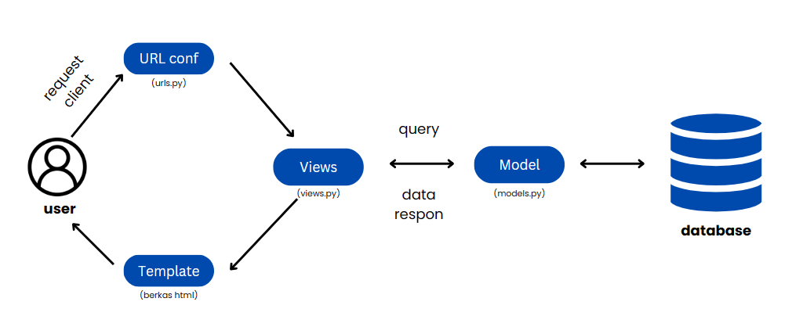

Nama : Dien Fitriani Azzahra

NPM : 2206828033

Kelas : PBP-F

tautan aplikasi : [tautan aplikasi CircleD ](https://dien-fitriani-tugas.pbp.cs.ui.ac.id/)

# TUGAS 6
## Jelaskan perbedaan antara asynchronous programming dengan synchronous programming.

Perbedaan antara asynchronous programming dan synchronous programming terletak pada cara mereka mengeksekusi tugas-tugas dalam program. Synchronous programming melakukan tugas satu per satu dalam urutan yang telah ditentukan, yang berarti setiap tugas harus menunggu tugas sebelumnya selesai sebelum dapat diproses. Hal ini mengakibatkan pemblokiran utas utama program hingga semua tugas selesai, yang dapat memperlambat waktu eksekusi. Sebaliknya, asynchronous programming memungkinkan tugas untuk diselesaikan tanpa harus menunggu tugas sebelumnya selesai terlebih dahulu. Ini berarti tugas-tugas dapat dieksekusi secara bersamaan atau dalam urutan yang tidak terikat pada prioritas. Kelebihan dari pendekatan ini adalah program tidak terikat pada proses I/O yang lambat, sehingga waktu eksekusi dapat menjadi lebih singkat dan efisien. Selain itu, asynchronous programming dapat meningkatkan responsifitas program dan mengoptimalkan penggunaan sumber daya. Dengan demikian, perbedaan mendasar antara keduanya adalah bagaimana mereka mengelola dan menyelesaikan tugas dalam program, dengan synchronous lebih terstruktur dan berurutan, sementara asynchronous lebih fleksibel dan tidak terikat oleh urutan eksekusi.

## Dalam penerapan JavaScript dan AJAX, terdapat penerapan paradigma event-driven programming. Jelaskan maksud dari paradigma tersebut dan sebutkan salah satu contoh penerapannya pada tugas ini.	

Paradigma event-driven programming adalah suatu metode pemrograman di mana alur program ditentukan oleh kejadian (events) yang terjadi. Dalam konteks JavaScript dan AJAX, ini berarti program menunggu dan merespons kejadian yang terjadi, seperti klik tombol, perubahan nilai dalam input field, pengiriman formulir, atau permintaan data dari server, sebelum melanjutkan eksekusi kode. Paradigma ini memungkinkan program menjadi lebih responsif, karena tidak perlu mengeksekusi kode secara terus-menerus, tetapi hanya saat diperlukan. Salah satu contoh penerapannya adalah ketika kita memiliki halaman web dengan tombol yang memicu permintaan AJAX ketika diklik. Dalam kasus ini, ketika tombol di klik, sebuah event (kejadian) "click" terjadi, dan program akan merespons event tersebut dengan menjalankan fungsi atau tindakan tertentu, seperti mengirim permintaan AJAX ke server untuk mengambil atau mengirim data tanpa menghentikan eksekusi program utama. Ini memungkinkan aplikasi web untuk tetap responsif terhadap tindakan pengguna tanpa harus menunggu proses-peroses yang lama selesai. Salah satu contoh penerapan paradigma event-driven programming dalam tugas ini adalah ketika pengguna mengklik tombol "Add Product by AJAX" atau "Delete Product by AJAX." Ketika tombol ini diklik, fungsi JavaScript yang sesuai dipanggil sebagai respons terhadap peristiwa ini. Pada contoh "Add Product by AJAX," fungsi addProduct akan dijalankan, dan pada contoh "Delete Product by AJAX," fungsi deleteProduct akan dijalankan. Dengan kata lain, eksekusi program tidak terjadi secara sekuensial, tetapi tergantung pada kejadian (klik tombol) yang terjadi dalam interaksi pengguna. Ini memungkinkan tampilan dan perilaku halaman web berubah secara dinamis sesuai dengan tindakan pengguna, yang menciptakan pengalaman yang lebih interaktif dan responsif.

## Jelaskan penerapan asynchronous programming pada AJAX.
Penerapan asynchronous programming pada AJAX adalah sebuah pendekatan yang memungkinkan pengiriman permintaan data ke server dan pengambilan data dari server dilakukan secara tidak langsung, tanpa harus memblokir eksekusi program utama. Dalam praktiknya, ini berarti bahwa program tidak perlu menunggu respons dari server sebelum melanjutkan eksekusi, sehingga memungkinkan program tetap responsif terhadap interaksi pengguna dan tugas-tugas lainnya. Langkah utama dalam penerapan asynchronous programming pada AJAX mencakup pengiriman permintaan ke server dengan menggunakan objek `XMLHttpRequest` atau API `fetch`, penanganan respons melalui definisi fungsi callback, dan penanganan respons sukses serta penanganan kesalahan. Ketika respons dari server tiba, fungsi callback akan dijalankan untuk memproses data yang diterima dan mengambil tindakan yang sesuai. Selain itu, asynchronous programming juga memungkinkan pengembang menjaga responsifitas aplikasi, memungkinkan pengguna untuk berinteraksi dengan halaman web tanpa mengalami gangguan atau penundaan yang berlebihan. 

## Pada PBP kali ini, penerapan AJAX dilakukan dengan menggunakan Fetch API daripada library jQuery. Bandingkanlah kedua teknologi tersebut dan tuliskan pendapat kamu teknologi manakah yang lebih baik untuk digunakan.

Fetch API adalah solusi modern yang disediakan oleh browser dan memiliki beberapa keunggulan, terutama dalam hal performa. Fetch API memungkinkan permintaan data ke server secara asynchronous dengan cara yang lebih ringkas dan sederhana dibandingkan dengan pendekatan lama menggunakan XMLHttpRequest. Selain itu, Fetch API mendukung Promise, yang membuat penanganan respons dari server menjadi lebih mudah dan bersih. Di sisi lain, jQuery adalah library JavaScript yang luas, yang tidak hanya menyediakan fitur AJAX untuk permintaan data ke server, tetapi juga berbagai fitur lain seperti manipulasi DOM, animasi, dan event handling. Jika proyeknya memerlukan banyak fitur ini, penggunaan jQuery bisa menjadi pilihan yang nyaman dan efisien. Namun, perlu diingat bahwa jQuery memerlukan library tambahan, yang dapat mempengaruhi performa dan ukuran total aplikasi. Dalam hal performa, Fetch API cenderung lebih cepat karena lebih ringan tanpa perlu mengunduh dan menginisialisasi library tambahan seperti jQuery. Jadi, jika performa adalah faktor kunci dalam proyek dan hanya memerlukan kemampuan AJAX, maka Fetch API mungkin menjadi pilihan yang lebih baik. Pilihan antara Fetch API dan jQuery tergantung pada kebutuhan proyek. Jika proyek fokus pada komunikasi dengan server dan performa yang optimal, Fetch API adalah pilihan yang kuat. Namun, jika proyek memerlukan banyak fitur lain dan kenyamanan dalam pengembangan, jQuery tetap menjadi opsi yang valid.

## Jelaskan bagaimana cara kamu mengimplementasikan checklist di atas secara step-by-step (bukan hanya sekadar mengikuti tutorial).
Untuk mengimplementasikan checklist yang diberikan di tugas ini, saya memodifikasi beberapa kode di file yang telah ada yakni views.py, urls.py dan main.html. Kode tersebut di antaranya yakni, pertama tambahan kode yang ada di file views.py yakni

    def get_product_json(request):
    product_item = Item.objects.all()
    return HttpResponse(serializers.serialize('json', product_item))

    @csrf_exempt
    def add_product_ajax(request):
    if request.method == 'POST':
        name = request.POST.get("name")
        category = request.POST.get("category")
        price = request.POST.get("price")
        amount = request.POST.get("amount")
        description = request.POST.get("description")
        user = request.user

        new_product = Item(name=name, category=category, price=price, amount=amount, description=description, user=user)
        new_product.save()

        return HttpResponse(b"CREATED", status=201)

    return HttpResponseNotFound()
     
Penjelasan : Kode di atas adalah bagian dari view pada aplikasi web Django. Pertama, get_product_json mengambil semua objek dari model Item menggunakan Item.objects.all(), kemudian mengonversinya menjadi format JSON menggunakan serializers.serialize, dan mengembalikan JSON sebagai respons HTTP saat permintaan GET diterima. Ini memungkinkan program untuk mengambil data produk melalui AJAX GET. Selanjutnya, add_product_ajax adalah view yang digunakan untuk menambahkan produk baru ke dalam database. Jika permintaan yang diterima adalah POST, view ini akan mengambil data seperti nama, kategori, harga, jumlah, dan deskripsi produk dari permintaan POST. Kemudian, view akan membuat objek Item baru dengan data tersebut, menyimpannya ke dalam database, dan mengembalikan respons HTTP dengan status "CREATED" (201 Created) jika produk berhasil ditambahkan. Jika permintaan bukan POST, view ini akan mengembalikan respons HTTP dengan status "Not Found" (404 Not Found)Sehingga halaman web dapat menambahkan produk baru melalui AJAX POST.

Selanjutnya di file urls.py saya menambahkan path baru yakni 

     urlpatterns = [
    # ...
    path('get-product/', get_product_json, name='get_product_json'),
    path('create-product-ajax/', add_product_ajax, name='add_product_ajax'),
    # ...
    ]

Penjelasan : Kode di atas adalah bagian dari file `urls.py` dalam aplikasi web Django yang menentukan rute atau URL endpoint yang akan digunakan untuk mengakses dua view, yaitu `get_product_json` dan `add_product_ajax`. Rute `'get-product/'` akan terkait dengan view `get_product_json`, yang digunakan untuk mengambil data produk melalui permintaan AJAX GET. Rute `'create-product-ajax/'` akan terkait dengan view `add_product_ajax`, yang memungkinkan penambahan produk baru ke dalam database melalui permintaan AJAX POST. Dengan demikian, pengguna dapat mengakses data produk atau menambahkan produk baru melalui URL yang sesuai dengan masing-masing view.

Dan terakhir, beberapa poin yang saya tambahkan dan ubah di file main.html adalah.
Pertama saya menambahkan script di akhir berkas

    
Penjelasan : Kode JavaScript di atas digunakan untuk mengatur tampilan produk pada halaman web dan berinteraksi dengan server melalui permintaan AJAX.

- getProducts: Fungsi ini bertujuan untuk mengambil data produk dari server menggunakan permintaan AJAX GET. Prosesnya dimulai dengan pemanggilan fetch API yang mengirimkan permintaan ke URL yang disediakan oleh . Setelah permintaan berhasil selesai, hasilnya diurai sebagai JSON dengan res.json(). Hasil JSON ini mengandung data produk yang kemudian dapat digunakan untuk memperbarui tampilan produk di halaman web.

- refreshProducts: Fungsi ini bertanggung jawab memperbarui tampilan produk pada halaman web. Setelah mengambil data produk dengan bantuan getProducts, fungsi ini membersihkan konten di dalam elemen dengan ID "product-card" (dengan document.getElementById("product-card").innerHTML = "") dan kemudian membangun tampilan produk baru berdasarkan data produk yang telah diambil. Data produk ini diambil dari hasil yang diperoleh melalui getProducts. Hasil HTML ini kemudian ditetapkan sebagai isi dari elemen "product-card," sehingga tampilan produk dihalaman web diperbarui dengan data yang paling baru.

- addProduct: Fungsi ini memungkinkan pengguna untuk menambahkan produk baru ke dalam database melalui permintaan AJAX POST. Ketika pengguna mengklik tombol "Add Product by AJAX," fungsi ini akan mengambil data dari formulir yang memiliki ID "form" menggunakan new FormData(document.querySelector('#form')) dan mengirimnya ke server menggunakan fetch. Setelah produk berhasil ditambahkan, tampilan produk diperbarui kembali dengan memanggil refreshProducts. Selain itu, formulir juga direset sehingga pengguna dapat menambahkan produk baru dengan mudah.

Selain kode di atas, untuk menampilkan modal untuk add product by ajax, penambahan button baru, dan tampilan cards yang disesuaikan saya menambahkan kode berikut

    

    

        

            

                <h1 class="modal-title fs-5" id="exampleModalLabel">Add New Product</h1>
                <button type="button" class="btn-close" data-bs-dismiss="modal" aria-label="Close"></button>
            

            

                <form id="form" onsubmit="return false;">
                    
                    

                        <label for="name" class="col-form-label">Name:</label>
                        <input id="name-input" type="text" class="form-control" id="name" name="name"></input>
                    

                    

                        <label for="category" class="col-form-label">Category:</label>
                        <input id="category-input" type="text" class="form-control" id="category" name="category"></input>
                    

                    

                        <label for="price" class="col-form-label">Price:</label>
                        <input id="price-input" type="number" class="form-control" id="price" name="price"></input>
                    

                    

                        <label for="amount" class="col-form-label">Amount:</label>
                        <input id="amount-input" type="number" class="form-control" id="amount" name="amount"></input>
                    

                    

                        <label for="description" class="col-form-label">Description:</label>
                        <textarea id="desc-input" class="form-control" id="description" name="description"></textarea>
                    

                </form>
            

            

                <button type="button" class="btn btn-secondary" data-bs-dismiss="modal">Close</button>
                <button type="button" class="btn btn-primary" id="button_add" data-bs-dismiss="modal">Add Product</button>
            

        

    

    

    ....
    

    ....
     <button type="button" class="btn btn-primary" data-bs-toggle="modal" data-bs-target="#exampleModal">Add Product by AJAX</button>

Penjelasan kode (tahap 1) : Kode HTML ini memberikan struktur sebuah modal pop-up yang digunakan dalam halaman web. Modal pop-up ini memiliki tujuan untuk mengizinkan pengguna untuk menambahkan produk baru dengan mengisi informasi yang diperlukan. Modal ini memiliki beberapa elemen penting, termasuk judul "Add New Product," sebuah formulir yang mencakup bidang input seperti nama, kategori, harga, jumlah, dan deskripsi produk, serta dua tombol di bagian bawah modal: "Close" dan "Add Product." 

Ketika pengguna mengklik tombol "Add Product by AJAX" di halaman web, modal ini muncul, memungkinkan mereka untuk memasukkan data produk baru. Pengguna dapat mengisi semua detail yang diperlukan dalam formulir ini. Modal ini juga telah disesuaikan untuk menggunakan token CSRF (Cross-Site Request Forgery) untuk memastikan keamanan saat mengirimkan data ke server. Setelah pengguna mengisi formulir dan mengklik tombol "Add Product," data produk yang dimasukkan akan dikirim ke server menggunakan permintaan AJAX POST. Tombol "Close" juga memungkinkan pengguna untuk menutup modal tanpa menambahkan produk. Keseluruhan elemen modal ini akan bekerja bersama dengan kode JavaScript yang sesuai.

Penjelasan kode (tahap 2): Kode HTML `

` adalah elemen tempat yang digunakan untuk menampilkan produk di halaman web. Dengan menggunakan kode ini, pembentukan elemen-elemen card produk yang sebelumnya dijelaskan dalam HTML, sekarang dilakukan melalui kode JavaScript. Data produk diambil dari server melalui permintaan AJAX GET, lalu diolah dan ditampilkan dinamis dalam elemen "product-card" dengan menggunakan JavaScript. Dengan demikian, perubahan ini memungkinkan program untuk memuat dan menampilkan produk secara dinamis tanpa perlu merender ulang seluruh halaman web setiap kali ada perubahan, menciptakan pengalaman yang lebih responsif bagi pengguna.

Penjelasan kode (tahap 3): Kode HTML `<button type="button" class="btn btn-primary" data-bs-toggle="modal" data-bs-target="#exampleModal">Add Product by AJAX</button>` adalah tombol yang memicu munculnya modal pop-up dengan ID "exampleModal" ketika diklik. Ketika pengguna mengklik tombol ini, modal "Add New Product" akan tampil di layar, memungkinkan mereka untuk memasukkan detail produk baru. Ini adalah elemen interaktif yang memungkinkan pengguna untuk memulai proses penambahan produk dengan menggunakan formulir yang ada dalam modal tersebut. Dengan demikian, tombol ini mengintegrasikan antara aksi pengguna dan tampilan modal, memfasilitasi penambahan produk baru ke dalam halaman web melalui AJAX.

Penjelasan singkat:
1. AJAX GET:
   - Ubah Kode Cards Data Item: Saya menhapus kode untuk pembuatan cards yang awalnya terdapat di berkas html dengan kode yang ada di atas, dan content cards diisi pada fungsi dalam script yakni saat refreshProduct()
   - Lakukan Pengambilan Task Menggunakan AJAX GET: Pada kode yang telah saya berikan, fungsi getProducts() yang menggunakan Fetch API untuk mengambil data item dari server melalui . Kemudian, memproses data ini dalam fungsi refreshProducts() dan menampilkan item di dalam elemen dengan ID "product-card".
2. AJAX POST:
   - Buat Tombol dan Modal untuk Tambah Item: Pada kode yang telah saya berikan, saya menambahkan tombol "Add Product by AJAX" yang membuka modal untuk menambahkan item. Tombol ini memicu fungsi addProduct().
   - Buat Fungsi View Baru: Pada kode yang telah saya berikan, fungsi view add_product_ajax yang menangani permintaan POST untuk menambahkan item baru ke basis data. Fungsi ini menerima data dari formulir modal dan menyimpan item baru ke basis data.
   - Buat Path untuk Fungsi View Baru: Pada kode yang telah saya berikan, saya menambahkan path "/create-product-ajax/" yang mengarah ke fungsi view add_product_ajax.
   - Hubungkan Form ke Path POST: Saat user mengklik tombol "Add Product" dalam modal dan mengirimkan formulir, data formulir akan dikirimkan ke path yang sesuai ( yakni /create-product-ajax/) dengan metode HTTP POST. Server saya akan kemudian menangani permintaan POST ini berdasarkan fungsi view yang saya definisikan, yaitu add_product_ajax, untuk menambahkan item baru ke basis data sesuai dengan data yang dimasukkan dalam formulir. Ini terdapat pada kode di berkas html tahap 1 di atas.
   - Lakukan Refresh Asinkronus: Pada kode yang telah saya berikan, setelah item berhasil ditambahkan ke basis data, program memanggil refreshProducts() untuk memperbarui tampilan produk di halaman web tanpa perlu me-reload seluruh halaman. Ini dilakukan dengan cara mengambil data produk terbaru melalui permintaan AJAX dan menggantikan konten produk yang ada.
3.  Melakukan perintah collectstatic.
   Dalam berkas settings.py di folder CircleD ditambahkan `STATIC_ROOT = os.path.join(BASE_DIR, 'static')` setelah itu saya simpan berkas yang saya ubah, dan saya jalankan direktori CircleD di cmd dengan command `python manage.py collectstatic   ` setelah dijalankan perintah tersebut terbentuk folder baru berisi

## BONUS
pada berkas views.py

pada berkas urls.py

pada berkas main.html

Penjelasan : Fungsi `deleteProduct(itemId)` digunakan untuk mengonfirmasi dan melakukan penghapusan produk secara asinkron dengan menggunakan teknologi AJAX, yang memungkinkan interaksi dengan server web tanpa perlu me-refresh halaman. Fungsi ini mengirim permintaan penghapusan ke server dengan metode "DELETE" tanpa harus memuat ulang seluruh halaman. Selain itu, ia juga menampilkan pesan konfirmasi kepada pengguna dalam jendela modal sebelum produk dihapus.

# TUGAS 5
## Jelaskan manfaat dari setiap element selector dan kapan waktu yang tepat untuk menggunakannya.
1. Elemen selector

Elemen selektor memiliki beberapa manfaat dalam pemrograman CSS. Pertama, elemen selektor berguna ketika ingin mengubah gaya pada semua elemen yang memiliki tag HTML yang sama. Misalnya, kita dapat dengan mudah mengatur tampilan semua elemen `<h1>` atau semua elemen `
` dalam halaman web  dengan hanya menggunakan elemen selektor yang sesuai. Selain itu, elemen selektor membantu menjaga konsistensi dalam tampilan halaman web. Dengan menerapkan aturan gaya yang sama pada semua elemen yang memiliki tag yang sama,  dapat dipastikan bahwa elemen-elemen tersebut memiliki tampilan yang seragam di seluruh halaman.Selain itu, elemen selektor dapat digunakan ketika kita memiliki elemen-elemen dengan tag yang sama, tetapi berada dalam konteks yang berbeda di halaman web. Misalnya, jika memiliki beberapa paragraf `
` yang berada dalam `
` yang berbeda, kita masih dapat menggunakan elemen selektor untuk mengatur tampilan mereka secara spesifik dalam konteks masing-masing `
`. Sehingga, elemen selektor sesuai digunakan ketika kita perlu mengontrol tampilan elemen-elemen dasar dalam halaman web dan memastikan bahwa tampilan tersebut konsisten di seluruh situs web, bahkan dalam konteks yang berbeda.

2. Elemen id

ID selector berguna ketika ingin mengubah tampilan elemen yang benar-benar unik dalam halaman web, karena ID harus bersifat unik dalam satu halaman web, sehingga ID selector memungkinkan untuk dengan mudah mengidentifikasi dan menerapkan gaya pada elemen-elemen yang hanya muncul sekali atau memiliki atribut ID yang benar-benar unik. Selain itu, ID selector juga berguna ketika memerlukan selektor yang lebih spesifik. Dalam situasi di mana terdapat beberapa elemen dengan tag HTML yang sama (misalnya, beberapa elemen `
`), ID selector memungkinkan untuk memilih dengan presisi elemen tertentu yang diinginkan. Dengan cara ini, dapat mengubah tampilan atau perilaku elemen tersebut tanpa memengaruhi elemen-elemen serupa yang ada di halaman.

3. Selektor Class

Class Selector memiliki beberapa kegunaan yang signifikan. Class Selector sangat berguna ketika ingin mengelompokkan elemen dengan gaya yang sama. Misalnya, jika terdapat beberapa elemen dengan karakteristik atau gaya yang serupa, seperti menggolongkan beberapa kotak konten dalam satu div, Class Selector memungkinkan untuk dengan mudah mengidentifikasi dan menerapkan gaya yang serupa pada semua elemen ini dengan menggunakan kelas yang sama. Selanjutnya, Class Selector cocok ketika ingin mengaplikasikan gaya yang sama pada lebih dari satu elemen dalam halaman web. Hal ini menghindari pengulangan aturan gaya yang identik dan memungkinkan untuk mengatur gaya dengan lebih efisien. Dengan kata lain, dapat dengan mudah menerapkan gaya yang konsisten pada berbagai elemen tanpa harus menulis ulang aturan gaya yang sama. Selain itu, Class Selector memberikan fleksibilitas yang lebih besar dalam pengelompokan dan penggunaan gaya. Dapat memberikan kelas tertentu kepada beberapa elemen yang mungkin memiliki karakteristik berbeda dan hanya menerapkan gaya pada elemen-elemen tersebut sesuai dengan kebutuhan.

## Jelaskan HTML5 Tag yang kamu ketahui.
`<html>`: Tag ini digunakan untuk mendefinisikan awal dan akhir dari dokumen HTML.

`<head>`: Tag ini berisi informasi meta tentang halaman web seperti judul, karakter set, dan referensi ke file CSS atau JavaScript.

`<title>`: Digunakan dalam elemen <head> untuk menentukan judul halaman web yang akan ditampilkan di bilah judul browser.

`<meta> ` Ini digunakan untuk menentukan metainformasi tentang halaman web, seperti deskripsi, kata kunci, atau karakter set yang digunakan.

`<link>` : Digunakan untuk menghubungkan halaman web dengan file eksternal, seperti file CSS atau ikon favicon.

`
Dengan begitu tampilan pada card akan konsisten sesuai dengan classnya. Selain cards saya juga melakukan beberap apenyesuaian warna dan sebagainya pada elemen lainnya. seperti pada button saya mengubah warnanya dengan kode css sebagai berikut.
    
     .btn-primary {
        background-color: #c06996 !important; /* Warna pink untuk tombol */
        border-color: #c06996 !important;
    }

    .btn-primary:hover {
        background-color: #661e43 !important; /* Warna pink saat dihover */
        border-color: #661e43 !important;
    }

dan mengubah latar dari website dengan css

    body {
        background-image: url('https://wallpapercave.com/wp/wp3152211.jpg'); 
        background-size: cover;
        background-repeat: no-repeat; 
        background-attachment: fixed; 
        height: 100vh;
    }
Pada ketiga halaman tersebut saya mengimplementasikannya seperti yang di atas hana saja ada beberapa hal yang perlu diatur sesuai dengan keperluan tiap page website saya.

### Kustomisasi halaman daftar inventori menjadi lebih berwarna maupun menggunakan apporach lain seperti menggunakan Card.
agar halaman daftar inventori yang berupa tabel tersebut berwarna, saya menggunakan selector class sebagai berikut

    table {
        width: 100%;
        border-collapse: collapse;
        border: 2px solid #000000; 
        background-color: #570932;
    }

    th, td {
        padding: 8px;
        text-align: center;
        border: 2px solid #000000;
    }

    table tr {
        background-color: #fdd3d3; 
        border: 2px solid #000000;
    }
   
    table tr:last-child {
        background-color: #420f29; 
        border: 2px solid #000000;
        color: #fff;
    }

dengan kode diatas saya menyesuaikan tabel pada CircleD sesuai keperluan website saya, seperti mengubah warna, memberi border, padding dan sebagainya
Sebagai tambahan saya juga menambahkan navbar pada halaman main. Dengan kode sebagai berikut

    ...
    .navbar {
        display: flex;
        justify-content: space-between;
        background-color: #333;
        padding: 10px 20px;
        color: #fff;
        font-size: 35px;
    }
    ...
    <nav class="navbar navbar-expand-lg navbar-light" style="background-color: #c06996;">
            

                

                    

                        <h1>
                            CircleD
                            <small class="fs-6 fst-italic">by dien</small>
                        </h1>
                    

                    

                        <form class="ml-auto">
                            <a href="">
                                <button class="btn btn-danger" type="button">Log out</button>
                            </a>
                        </form>
                    

                

            

        </nav>
        ...
    

## BONUS
Memberikan warna yang berbeda (teks atau background) pada baris terakhir dari item pada inventori anda menggunakan CSS.
css:

    table tr:last-child {
        background-color: #420f29; 
        border: 2px solid #000000;
        color: #fff;
    }

penjelasan kode: mengubah tampilan baris terakhir dalam sebuah tabel, dengan memberikan latar belakang berwarna #420f29, batasan pinggir tebal 2px berwarna hitam (#000000), dan warna teks putih (#fff) untuk baris tersebut.

# TUGAS 4
## 1. Apa itu Django UserCreationForm, dan jelaskan apa kelebihan dan kekurangannya?
UserCreationForm adalah salah satu formulir bawaan yang disediakan oleh Django. Formulir ini dirancang untuk keperluan pendaftaran pengguna dalam aplikasi web yang memerlukan sistem otentikasi dan manajemen pengguna. Penggunaan UserCreationForm dalam Django memiliki banyak kelebihan, seperti kemudahan penggunaan, kemampuan penyesuaian, dan fungsionalitas bawaan yang lengkap. UserCreationForm telah dirancang dengan baik untuk memvalidasi dan memproses data pendaftaran pengguna. Ini memungkinkan pengembang untuk dengan mudah mengimplementasikan proses pendaftaran pengguna yang aman dan efisien tanpa perlu menulis kode validasi yang rumit. Selain itu, UserCreationForm juga berintegrasi dengan baik dengan sistem otentikasi Django, yang memungkinkan pengguna untuk masuk ke aplikasi dengan mudah setelah mendaftar. Ini menghemat waktu dan upaya pengembang dalam mengelola otentikasi pengguna. Terakhir, UserCreationForm dapat disesuaikan sesuai kebutuhan. Pengembang dapat menambahkan kolom tambahan atau mengubah perilaku form sesuai dengan persyaratan aplikasi mereka. Hal ini memberikan fleksibilitas dalam mengelola proses pendaftaran pengguna. Namun, terdapat beberapa kekurangan dalam penggunaan UserCreationForm ini. Pertama, UserCreationForm biasanya memerlukan penyesuaian tambahan agar sesuai dengan kebutuhan aplikasi tertentu, yang bisa menjadi hal kompleks jika memiliki persyaratan kustom yang kompleks. Kedua, UserCreationForm biasanya dirancang untuk mengelola informasi dasar pengguna seperti username dan password, sehingga jika program perlu mengumpulkan data tambahan, pengembang perlu menambahkan kolom tambahan secara manual. Terakhir, dalam beberapa kasus, UserCreationForm mungkin tidak mengatasi masalah keamanan yang lebih canggih seperti serangan brute force atau perlindungan terhadap bot.

## 2. Apa perbedaan antara autentikasi dan otorisasi dalam konteks Django, dan mengapa keduanya penting?
Dalam konteks Django, autentikasi dan otorisasi adalah dua aspek penting yang berperan dalam mengelola akses pengguna dalam aplikasi web. Autentikasi adalah proses verifikasi identitas seorang pengguna, memastikan bahwa pengguna tersebut adalah diri mereka sendiri. Ini biasanya terlibat dalam proses login di mana pengguna harus memberikan kredensial seperti username dan kata sandi untuk membuktikan identitas mereka. Sementara itu, otorisasi adalah langkah selanjutnya setelah autentikasi. Ini berkaitan dengan apa yang dapat dilakukan oleh pengguna yang telah diautentikasi. Dalam kata lain, otorisasi menentukan hak akses pengguna ke bagian-bagian khusus dari aplikasi atau ke tindakan-tindakan tertentu dalam aplikasi tersebut. Misalnya, otorisasi dapat memutuskan apakah pengguna yang telah diautentikasi memiliki izin untuk mengedit atau menghapus data tertentu, atau hanya memiliki izin untuk melihatnya. Django menyediakan sistem autentikasi dan otorisasi yang kuat.  Keberadaan sistem autentikasi dan otorisasi dalam Django adalah kunci untuk melindungi data dan fungsi penting dalam aplikasi. Ini memastikan bahwa pengguna hanya memiliki akses ke bagian-bagian yang sesuai dengan hak mereka, menjaga keamanan dan integritas aplikasi web. Sehingga sangat penting unuk mengimplementasikan keduanya.  

## 3. Apa itu cookies dalam konteks aplikasi web, dan bagaimana Django menggunakan cookies untuk mengelola data sesi pengguna?
Dalam konteks aplikasi web, cookies adalah sejumlah kecil data yang dikirim oleh server kepada peramban web pengguna. Peramban kemudian dapat menyimpan cookie tersebut dan mengirimkannya kembali ke server yang sama dalam permintaan-permintaan berikutnya. Secara umum, cookie HTTP digunakan untuk mengetahui apakah dua permintaan berasal dari peramban yang sama, misalnya untuk menjaga pengguna tetap masuk ke dalam aplikasi. Mereka mengingat informasi yang bersifat stateful dalam protokol HTTP yang sebenarnya bersifat stateless. Cookies biasanya digunakan untuk tiga tujuan utama: Manajemen Sesi (Session Management), Personalisasi (Personalization), dan Pelacakan (Tracking). Django menggunakan cookies untuk mengelola data sesi pengguna dengan cara yang memungkinkan aplikasi untuk menyimpan informasi seperti status masuk pengguna atau preferensi pengguna selama sesi mereka. Memungkinkan pengalaman pengguna yang lebih personal dan fungsional. Cookies sebagai alat untuk mengelola data sesi pengguna dalam aplikasi web. Prosesnya dimulai dengan pembuatan ID sesi unik untuk setiap pengguna yang mengakses aplikasi. ID sesi ini kemudian disimpan dalam sebuah cookie yang dikirim ke peramban pengguna. Setiap permintaan berikutnya dari peramban akan mengirimkan kembali cookie sesi ini ke server, memungkinkan Django mengidentifikasi pengguna dan mengakses data sesi mereka. Data sesi, seperti status masuk atau preferensi pengguna, dapat disimpan dan dikelola dalam penyimpanan sesi yang aman. Ketika sesi pengguna berakhir, data sesi tidak lagi diperlukan dan dapat dibersihkan. Penggunaan cookies untuk mengelola sesi pengguna ini memberikan pengalaman pengguna yang lebih nyaman dan personal dalam aplikasi Django. Namun, perlu diingat bahwa keamanan dan privasi data sesi harus dijaga dengan cermat oleh pengembang untuk melindungi informasi pengguna.

## 4. Apakah penggunaan cookies aman secara default dalam pengembangan web, atau apakah ada risiko potensial yang harus diwaspadai?

Secara default penggunaan cookies tidak selalu aman, bergantung pada pengelolaan aplikasi. Cookies yang tidak dilindungi dapat dimanipulasi dan mengakibatkan risiko keamanan serius bagi pengguna dan organisasi. Misalnya, cookies dapat diretas. Kebanyakan situs web menggunakan cookies sebagai satu-satunya identifikasi untuk sesi pengguna, sehingga jika cookie diretas, seorang hacker dapat meniru pengguna dan mendapatkan akses yang tidak sah. Ini dapat terjadi melalui beberapa cara, seperti menangkap cookies melalui saluran yang tidak aman, penyerangan melalui sesi fixation, cross-site scripting (XSS), cross-site request forgery (CSRF), atau cookie tossing. Penggunaan cookies juga dapat memiliki dampak serius terhadap privasi. Cookies dapat digunakan untuk melacak pengguna, memungkinkan profil penggunaan dan preferensi website. Ini telah memunculkan kekhawatiran privasi dan bahkan peraturan tertentu untuk mencegah penyalahgunaan cookies. Jadi, penggunaan cookies dalam pengembangan web tidak selalu aman secara default. Sangat penting untuk mengelola dan melindungi cookies dengan cermat, terutama yang berhubungan dengan data sensitif atau otentikasi pengguna. Penerapan praktik keamanan seperti pengiriman cookies melalui saluran yang aman, perlindungan terhadap sesi fixation, dan melindungi terhadap serangan XSS dan CSRF adalah langkah penting untuk menjaga keamanan dan privasi pengguna dalam penggunaan cookies.

## 5.  Jelaskan bagaimana cara kamu mengimplementasikan checklist di atas secara step-by-step (bukan hanya sekadar mengikuti tutorial).
#### Mengimplementasikan fungsi registrasi, login, dan logout untuk memungkinkan pengguna untuk mengakses aplikasi sebelumnya dengan lancar.
Untuk dapat mengimplementasikan ketiganya saya membuat fungsi dan formnya. Sebelum pengimplementasian, seperti biasa kita perlu untuk menjalankan virtual environment terlebih dahulu. Setelah itu, saya memodifikasi isi beberapa berkas seperti `views.py`, `urls.py` dan menambahkan beberapa berkas html. Dalam views.py saya menambahkan 3 fungsi yakni fungsi register, login, dan logout, dengan baris kode sebagai berikut
    
    from django.shortcuts import redirect
    from django.contrib.auth.forms import UserCreationForm
    from django.contrib import messages  
    
    def register(request):
        form = UserCreationForm()
    
        if request.method == "POST":
            form = UserCreationForm(request.POST)
            if form.is_valid():
                form.save()
                messages.success(request, 'Your account has been successfully created!')
                return redirect('main:login')
        context = {'form':form}
        return render(request, 'register.html', context)
Penjelasan kode(register) : Saya mengimport beberapa komponen dari Django yang diperlukan untuk register. Dalam fungsi register, saya membuat formulir untuk register. Form digunakan untuk mengumpulkan data yang diperlukan dari user, dengan UserCreationForm sehingga pengolahan data inputan user menjadi lebih mudah. Di dalam fungsi ini juga, ditambahkan if condition. Program memeriksa jika permintaan yang diterima adalah metode "POST" (yaitu, ketika pengguna mengirimkan data pendaftaran), maka kita mengambil data yang dikirim oleh pengguna dan memvalidasinya dengan formulir. Jika form falid, maka informasi akan disimpan dan menampilkan message success. Setelah berhasil menjalankan fungsi register, halaman web akan redirect ke halaman main:login.

    from django.contrib.auth import authenticate, login
    def login_user(request):
        if request.method == 'POST':
            username = request.POST.get('username')
            password = request.POST.get('password')
            user = authenticate(request, username=username, password=password)
            if user is not None:
                login(request, user)
                return redirect('main:show_main')
            else:
                messages.info(request, 'Sorry, incorrect username or password. Please try again.')
        context = {}
        return render(request, 'login.html', context)
Penjelasan kode(login) : 
Ketika sebuah permintaan POST diterima, kode ini mengambil nama pengguna (username) dan kata sandi (password) yang dikirimkan oleh pengguna melalui formulir login. Selanjutnya, menggunakan fungsi authenticate(), kode memeriksa kecocokan antara data yang dimasukkan dengan akun pengguna yang ada dalam sistem. Jika otentikasi berhasil, pengguna dianggap telah masuk dan diarahkan ke halaman utama. Namun, jika otentikasi gagal, kode menampilkan pesan kesalahan yang memberi tahu pengguna bahwa nama pengguna atau kata sandi yang dimasukkan salah, dan pengguna tetap berada di halaman login.

    from django.contrib.auth import logout
    def logout_user(request):
        logout(request)                                                    
        return redirect('main:login')
Penjelasan kode(logout) : Saat fungsi ini dipanggil, pengguna saat ini akan keluar dari sesi mereka. Ini dilakukan dengan menggunakan fungsi logout() yang disediakan oleh Django. Setelah keluar, pengguna diarahkan kembali ke halaman login (dalam hal ini, 'main:login').

Saya juga menambahkan 2 berkas HTML dan memodifikasi isi berkas `main.html`
berkas html baru adalah register.html yang berisi
    
    
    
    
        <title>Register</title>
    
    
      
    
    

        
        <h1>Register</h1>  
    
            <form method="POST" >  
                  
                <table>  
                    {{ form.as_table }}  
                    <tr>  
                        <td></td>
                        <td><input type="submit" name="submit" value="Daftar"/></td>  
                    </tr>  
                </table>  
            </form>
    
          
            <ul>   
                  
                    <li>{{ message }}</li>  
                      
            </ul>   
        
    
    
  
    
    
berkas ini digunakan untuk halaman pendaftaran dalam aplikasi Django. Template ini mendefinisikan blok konten utama di mana formulir pendaftaran, termasuk token CSRF, ditampilkan dalam bentuk tabel. Pengguna dapat mengisi formulir dan mengirimkannya. Jika ada kesalahan, maka akan ditampilkan pesan gagal.      
selain berkas register.html, perlu ditambahkan pula berkas login.html yang berisi  
    
    
    
    
        <title>Login</title>
    
    
    
    
    

    
        <h1>Login</h1>
    
        <form method="POST" action="">
            
            <table>
                <tr>
                    <td>Username: </td>
                    <td><input type="text" name="username" placeholder="Username" class="form-control"></td>
                </tr>
                        
                <tr>
                    <td>Password: </td>
                    <td><input type="password" name="password" placeholder="Password" class="form-control"></td>
                </tr>
    
                <tr>
                    <td></td>
                    <td><input class="btn login_btn" type="submit" value="Login"></td>
                </tr>
            </table>
        </form>
    
        
            <ul>
                
                    <li>{{ message }}</li>
                
            </ul>
             
            
        Don't have an account yet? <a href="">Register Now</a>
    
    

    
    

berkas  bertujuan untuk membuat halaman login dalam aplikasi Django. Halaman ini memungkinkan pengguna untuk memasukkan kredensial mereka (nama pengguna dan kata sandi) untuk masuk ke dalam aplikasi. Berkas ini diperlukan karena ini adalah interface yang diperlihatkan kepada pengguna untuk proses otentikasi, yang penting untuk mengamankan akses ke aplikasi dan memberikan pengguna akses ke fitur-fitur terbatas berdasarkan hak akses mereka.

Serta memodifikasi berkas main.html untuk menambahkan button ke halaman main,
      
      ...
      <a href="">
          <button>
              Logout
          </button>
      </a>
      ...
Selain `views.py` saya juga perlu mengubah `urls.py` yakni 

    from main.views import register 
    from main.views import login_user
    from main.views import logout_user

    ...
    path('register/', register, name='register'), 
    path('login/', login_user, name='login'),
    path('logout/', logout_user, name='logout'),
    ]
Penjelasan ; Kode ini menghubungkan tiga URL dalam aplikasi Django dengan fungsi tampilan yang sesuai. URL '/register/' diarahkan ke fungsi pendaftaran, URL '/login/' diarahkan ke fungsi login, dan URL '/logout/' diarahkan ke fungsi logout. Dengan begitu user dapat melakukan register, login, dan logout di web CircleD sesuai dengan permintaan mereka.

#### Membuat dua akun pengguna dengan masing-masing tiga dummy data menggunakan model yang telah dibuat pada aplikasi sebelumnya untuk setiap akun di lokal.
Untuk membuat akun di web CircleD, user dapat melakukan register terlebih dahulu. pertama, user akan ditampilkan dengan halaman login   

Pada bagian bawah, tertera `register now`, ketika user mengklik maka tampilan web akan berubah sebagai berikut

Setelah user berhasil register, user dapat kembali ke halaman login sebelum dan memasukkan username serta password valid. Setelah username tervalidasi , user dapat mengakses fitur dari CircleD dan menambahkan item di CircleD dengan button  yang telah dibuat sebelumya.

Sehingga, tampilan akhir setelah user membuat dua akun berbeda dengan masing masing 3 item berbeda,

#### Menghubungkan model Item dengan User.
Agar produk dibuat user terhubung dengan pemilik(User) yang terotorisasi, perlu ditambahkan beberapa kode di bawah di beberapa berkas.  

dalam berkas models.py

    ...
    from django.contrib.auth.models import User
    ...

    class Product(models.Model):
        user = models.ForeignKey(User, on_delete=models.CASCADE)
        ...

dalam berkas views.py

     def show_main(request):
        items = Item.objects.filter(user=request.user)

        context = {
            'name': request.user.username,
        ...
        
     def create_product(request):
         form = ProductForm(request.POST or None)

         if form.is_valid() and request.method == "POST":
             product = form.save(commit=False)
             product.user = request.user
             product.save()
             return HttpResponseRedirect(reverse('main:show_main'))
         ...
    
Penjelasan :
Kode diatas bertujuan untuk mengaitkan item yang dibuat dalam aplikasi dengan pemilik(user) yang terotentikasi. Pertama, dalam berkas models.py, kita menambahkan sebuah relasi menggunakan ForeignKey yang menghubungkan setiap produk dengan pengguna (User) yang membuatnya. Ini memungkinkan setiap produk memiliki pemilik yang terkait. Kemudian, dalam berkas views.py, dalam fungsi create_product, ketika produk baru dibuat melalui formulir, program mengaitkan produk tersebut dengan pengguna yang sedang masuk dengan cara product.user = request.user. Ini memastikan bahwa produk yang baru dibuat dikaitkan dengan pengguna yang membuatnya. Selanjutnya, dalam fungsi show_main, kita mengambil semua produk yang terkait dengan pengguna yang sedang masuk dengan menggunakan Item.objects.filter(user=request.user). Ini memungkinkan pengguna hanya melihat produk yang mereka buat. Dengan begitu, program menghubungkan produk dengan pemiliknya dan memastikan bahwa setiap pengguna hanya melihat produk yang mereka buat.

#### Menampilkan detail informasi pengguna yang sedang logged in seperti username dan menerapkan cookies seperti last login pada halaman utama aplikasi.
Untuk penggunaan cookies, perlu dimodifikasi berkas views.py yakni dengan menambahkan kode di bawah

    import datetime
    from django.http import HttpResponseRedirect
    from django.urls import reverse

    ...
    if user is not None:
        login(request, user)
        response = HttpResponseRedirect(reverse("main:show_main")) 
        response.set_cookie('last_login', str(datetime.datetime.now()))
        return response
    ...
    context = {
        'name': request.user.username,
        'class': 'PBP A',
        'products': products,
        'last_login': request.COOKIES['last_login'],
    }
Pertama, kode ini mengimpor modul yang diperlukan dan menambahkannya ke bagian atas berkas views.py. Kemudian, dalam fungsi login_user, setelah pengguna berhasil login (sesuai dengan kondisi if user is not None), kode membuat objek respons dengan HttpResponseRedirect yang mengarahkan pengguna ke halaman utama (main:show_main). Selain itu, kode ini mengatur cookie bernama "last_login" dengan nilai timestamp saat ini menggunakan response.set_cookie. Ini memungkinkan waktu terakhir login pengguna untuk disimpan dalam cookie "last_login" dan akan ditampilkan di halaman utama aplikasi. Penggunaan cookie ini membantu melacak aktivitas login pengguna. Sedangkan, request.user.username untuk menampilkan informasi username pengguna yang sedang logged in. Agar last login dapat dilihat pengguna di halaman main, mkaa perlu ditambahkan line berikut di berkas main.hml

    ...
    <h5>Sesi terakhir login: {{ last_login }}</h5>
    ...
 
   
## BONUS
- untuk mambahkan tombol dan fungsi untuk menambahkan amount suatu objek sebanyak satu dan tombol untuk mengurangi jumlah stok suatu objek sebanyak satu serta mambahkan tombol dan fungsi untuk menghapus suatu objek dari inventori, saya menambahkan beberapa fungsi di bawah
dalam berkas views.py:

 

 dan mengimpor 

dalam urlpatterns ditambahkan baris berikut, dan menambahkan impor yang bersesuaiann

 Agar button untuk increment, decrement, dan delete item tampil pada halaman main user, perlu untuk ditambahkan kode berikut di berkas main.html
 
 

 Dengan tampilan akhir tabel item pada halaman main sebagai berikut

 

# TUGAS 3
##  1. Apa perbedaan antara form POST dan form GET dalam Django?

Pada dasarnya form POST digunakan untuk mengirim data ke server, yang bila proses tersebut berhasil akan mengembalika kode status HTTP 201, sedangkan GET digunakan untuk membaca data dari server web, yang bila proses berhasil akan mengembalikan kode status HTTP 200. Namun, secara spesifik, perbedaan form POST dan GET dalam Django dapat diklasifikasi dalam beberapa poin
- Pengambilan Variabel:

  POST: Variabel diambil menggunakan `request.POST.get` dalam Django
  
  GET: Variabel diambil menggunakan `request.GET.get` dalam Django 
  
- Tujuan Penggunaan:

  POST: Form POST biasanya digunakan untuk mengirim data-data yang ingin disimpan di server.
  
  GET: Form GET biasanya digunakan untuk mengirim data-data untuk membaca data dari server, biasanya digunakan untuk pencarian atau filter.

- Tampilan Nilai Variabel di URL:

  POST: Nilai variabel tidak ditampilkan di URL, sehingga data tidak terlihat secara terbuka di URL.

  GET: Nilai variabel ditampilkan di URL, sehingga pengguna dapat dengan mudah memasukkan nilai variabel baru, sehingga data terlihat dalam URL dan dapat dengan mudah diakses atau dimodifikasi oleh pengguna lain.

## 2. Apa perbedaan utama antara XML, JSON, dan HTML dalam konteks pengiriman data?

Ketiganya memiliki perbedaan. XML (eXtensible Markup Language) didesain menjadi self-descriptive. Ini memanfaatkan tag dan atribut untuk mendefinisikan struktur data dengan fleksibilitas yang tinggi. Namun, penulisannya bisa menjadi lebih panjang karena tag pembuka dan penutup yang harus ditambahkan. JSON (JavaScript Object Notation) didesain menjadi self-describing. JSON menggunakan sintaksis mirip objek JavaScript untuk merepresentasikan data dalam bentuk key-value pairs. JSON lebih ringkas dibandingkan dengan XML, sehingga lebih efisien dalam hal penggunaan ruang. Sedangkan, HTML (Hypertext Markup Language) adalah bahasa markup yang khusus digunakan untuk membuat dokumen web. Fokus utamanya adalah pada struktur dan tampilan konten web dengan menggunakan elemen-elemen tetap, seperti tag `
` untuk divisi dan tag `
` untuk paragraf. Perbedaan lain adalah XML dapat digunakan dengan berbagai bahasa pemrograman dan tidak terkait dengan bahasa tertentu. JSON memiliki akar dalam JavaScript, tetapi telah diterima secara luas sebagai format pertukaran data di berbagai bahasa pemrograman. HTML, di sisi lain, digunakan eksklusif untuk membuat halaman web dengan fokus pada tampilan dan perilaku, bukan pertukaran data mentah. 

contoh tampilan JSON

contoh tampilan XML

contoh tampilan HTML

## 3. Mengapa JSON sering digunakan dalam pertukaran data antara aplikasi web modern?
Seperti yang sudah disinggung pada pertanyaan sebelumnya, JSON memang populer dalam pengembangan web. Hal tersebut dikarenakan JSON memiliki sejumlah keunggulan yang membuatnya menjadi pilihan yang populer. Pertama, JSON adalah format bahasa yang ringan dan mudah dibaca oleh manusia, sehingga lebih mudah untuk dikonsumsi oleh pengembang dan lebih efisien dalam hal ukuran file. Selain itu, penggunaan JSON tidak memerlukan DOM XML yang kompleks, seperti yang diperlukan dalam penggunaan XML, yang berarti penggunaan string yang lebih panjang dan kompleks tidak diperlukan. JSON juga memiliki kecepatan penguraian yang lebih baik, karena memiliki struktur yang lebih sederhana, sehingga memungkinkan transfer data menjadi lebih cepat. Karena JSON adalah berbasis JavaScript, yang dikenal karena kesederhanaannya, pengembangan menggunakan JSON menjadi lebih mudah dan responsif terhadap permintaan. Keunggulan lainnya adalah kemampuan JSON dalam menangani API untuk aplikasi web atau desktop, serta dukungan yang luas untuk bahasa pemrograman lainnya, seperti PostgreSQL dan JavaScript. Fleksibilitas JSON membuatnya sering digunakan dalam pertukaran data antara aplikasi web modern.

## 4. Jelaskan bagaimana cara kamu mengimplementasikan checklist di atas secara step-by-step (bukan hanya sekadar mengikuti tutorial).

Agar dapat mengatur form yang digunakan dalam aplikasi CircleD saya perlu membuat berkas baru bernama `forms.py` pada direktori main. Dalam berkas tersebut saya menambahkan kode:
  
    from django.forms import ModelForm
    from main.models import Item
    
    class ProductForm(ModelForm):
        class Meta:
            model = Item
            fields = ["name", "category", "price", "amount", "description"]
Dengan kode di atas, saya membuat form dengan nama productform yang terkait dengan Item yang telah saya buat pada tugas sebelumnya dengan mencantumkan beberapa field. Dengan begitu, nantinya pengguna aplikasi dapat membuat form dengan model Item di aplikasi CircleD, yang memungkinkan dalam menginput data baru dalam aplikasi ke database secara otomatis.

Selanjutnya saya mengimport modul dan membuat fungsi baru pada berkas views.py. Hal ini ditujukan karena peran views.py sebagai penanganan HTTP request oleh pengguna CircleD, sehingga saat client mengisi dan mengirimkan form, aplikasi tahu apa yang harus dilakukan atas permintaan tersebut. Modul dan kode yang perlu ditambahkan dalam berkas views.py adalah:

    from django.http import HttpResponseRedirect
    from main.forms import ProductForm
    from django.urls import reverse

    def create_product(request):
        form = ProductForm(request.POST or None)

        if form.is_valid() and request.method == "POST":
            form.save()
            return HttpResponseRedirect(reverse('main:show_main'))

         context = {'form': form}
         return render(request, "create_product.html", context)
         
Maksud dari fungsi `create_product` adalah untuk mengelola proses penambahan produk baru dalam aplikasi CircleD. Ketika pengguna mengakses halaman "Tambah Produk" fungsi ini pertama-tama membuat sebuah formulir kosong yang disebut form. Formulir ini digunakan untuk mengumpulkan informasi yang diperlukan untuk membuat produk baru, seperti nama, kategori, harga, jumlah, dan deskripsi produk. Selanjutnya, fungsi ini memeriksa apakah pengguna telah mengisi formulir dengan benar dan mengirimkannya. Jika formulir valid dan permintaan merupakan tipe POST, artinya data produk telah diisi dengan benar dan siap untuk disimpan. Ketika kondisi tersebut terpenuhi, fungsi `form.save()` digunakan untuk menyimpan data produk ke dalam database aplikasi. Terakhir, setelah data produk berhasil disimpan, pengguna akan redirect ke halaman utama menggunakan `HttpResponseRedirect`. 

Agar data yang dimasukkan client dapat tampil pada halaman utama, saya memperbarui fungsi show_main dalam berkas views.py. yakni menambahkan 

    ...          
    'items': items,
    ...
dalam context, sehingga akan mengambil data semua item dan menampilkannya di halaman utama. Saya juga perlu memperbarui berkas `urls.py` saya agar aplikasi CircleD saya dapat mengarahkan request client ke URL yang sesuai. Saya menambahkan import create_product dan menambahkan path URL agar dapat mengakses fungsi create_product.

      ...
      path('create-product', create_product, name='create_product'),
      ...

Selanjutnya berkas HTML `create_product.html` perlu dibuat untuk penyediaan user interface yang memungkinkan pengguna untuk memasukkan data produk baru. Berkas ini berfungsi untuk menampilkan formulir yang dapat diisi oleh pengguna dengan informasi produk, seperti nama, kategori, harga, jumlah, dan deskripsi. Selain itu, HTML memungkinkan validasi input, pengaturan tampilan halaman, dan penggunaan template untuk menampilkan dan mengelola data produk. Isi dalam berkas `create_product.html` saya isi dengan

       

      
      <h1>Add New Product</h1>
      
      <form method="POST">
          
          <table>
              {{ form.as_table }}
              <tr>
                  <td></td>
                  <td>
                      <input type="submit" value="Add Product"/>
                  </td>
              </tr>
          </table>
      </form>
      
      
Dan terakhir saya memperbarui berkas `main.html` saya. Hal ini ditujukan agar data items dapat ditampilkan dalam halamn utama dalam bentuk tabel dan tombol untuk menambahkan produk yang akan mengarahkan ke halaman form yang telah dibuat sebelumnya.

      ...
       <table>
        <tr>
            <th>Name</th>
            <th>Category</th>
            <th>Price</th>
            <th>Amount</th>
            <th>Description</th>
        </tr>
       
        
            <tr>
                <td>{{item.name}}</td>
                <td>{{item.category}}</td>
                <td>{{item.price}}</td>
                <td>{{item.amount}}</td>
                <td>{{item.description}}</td>
            </tr>
        
    </table>
    
     
    
    <a href="">
        <button>
            Add New Product
        </button>
    </a>
    ...

Sebelumnya, saya telah membuat fungsi views dalam format HTML, namun terdapat beberapa hal yang saya ubah, sehingga dalam Tugas 3 untuk fungsinya sebagai berikut

      def show_main(request):
          items = Item.objects.all()
          item_count = len(items)
          context = {
              'name': 'Dien',
              'class': 'F',
              'items': items,
              'item_count' : item_count
          }
      
          return render(request, "main.html", context)
saya menambahkan line

          ...
          item_count = len(items)
          ....
          'items': items,
          'item_count' : item_count
          
item_count --> bonus,  saya menambahkan line items agar informasi yang disimpan mengenai item dapat dilihat dari aplikasi CircleD. Agar client dapat melihat tampilan data dalam format XML, JSON, XML by ID, dan JSON by ID. Saya menambahkan 4 fungsi lainnya yakni, 

    def show_xml(request):
        data = Item.objects.all()
        return HttpResponse(serializers.serialize("xml", data), content_type="application/xml")
    
    def show_json(request):
        data = Item.objects.all()
        return HttpResponse(serializers.serialize("json", data), content_type="application/json")
    
    def show_xml_by_id(request, id):
        data = Item.objects.filter(pk=id)
        return HttpResponse(serializers.serialize("xml", data), content_type="application/xml")
    
    def show_json_by_id(request, id):
        data = Item.objects.filter(pk=id)
        return HttpResponse(serializers.serialize("json", data), content_type="application/json")
Fungsi show_xml dan show_json digunakan untuk mengambil semua data Item dari database dan mengirimkannya kembali sebagai respons dalam format XML ataupun JSON. Sedangkan, fungsi show_xml_by_id dan show_json_by_id digunakan untuk mengambil data Item berdasarkan ID yang diberikan dalam permintaan saja, kemudian mengirimkannya kembali dalam format XML atau JSON. 

Terakhir, ketika url tertentu diakses pengguna, maka program akan memanggil fungsi view yang bersesuaian agar flow aplikasi sesuai dengan permintaan client. Dengan begitu, saya perlu menambahkan 4 path baru pada berkas `urls.py` yakni,

          ...
          path('xml/', show_xml, name='show_xml'), 
          path('json/', show_json, name='show_json'), 
          path('xml/<int:id>/', show_xml_by_id, name='show_xml_by_id'),
          path('json/<int:id>/', show_json_by_id, name='show_json_by_id'), 
          ...
maksud dari kode di atas adalah, misal ketika http://localhost:8000/xml/ diakses pengguna maka sesuai dengan pola pada baris perama di atas , maka komponen view yang menghandle permintaan tersebut adalah show_xml, sedangkan name di tujukan untuk memberikan nama rute tersebut tanpa harus mengingat pola URL-nya secara eksplisit.

## 5.  Mengakses kelima URL di poin 2 menggunakan Postman, membuat screenshot dari hasil akses URL pada Postman, dan menambahkannya ke dalam README.md.
HTML 

XML

XML(berdasarkan id)

JSON

JSON (berdasarkan id)

## BONUS
Menambahkan pesan "Kamu menyimpan X item pada aplikasi ini" (dengan X adalah jumlah data item yang tersimpan pada aplikasi) dan menampilkannya di atas tabel data. Kalimat pesan boleh dikustomisasi sesuai dengan tema aplikasi, namun harus memiliki makna yang sama.

kode yang ditambahkan

# TUGAS 2                      
## 1. Jelaskan bagaimana cara kamu mengimplementasikan checklist di atas secara step-by-step (bukan hanya sekadar mengikuti tutorial).
Sesuai dengan checklist pertama saya membuat proyek Django baru bernama CircleD. Namun, sebelum proyek dapat terbentuk, saya perlu melakukan beberapa tahapan awal terlebih dahulu seperti mensetup direktori dan repositori GitHub baru untuk proyek ini. Dari direktori yang sudah saya sesuaikan pada local laptop tersebut, saya melakukan instalasi Django dan inisiasi proyek Django yang akan dibuat, dengan menggunakan virtual environment. Cara membuat(line 1) dan mengaktifkan(line 2) virtual environment:
        
        python -m venv env  
        env\Scripts\activate.bat
        
Agar pengembangan aplikasi Circle D nantinya menjadi lebih mudah, perlu juga untuk disiapkan depedencies agar mudah dalam memanfaatkan library, framework, ataupun package, dengan membuat berkas requirements yang berisi

        
        django
        gunicorn
        whitenoise
        psycopg2-binary
        requests
        urllib3
        
penjelasan : `django` merupakan framework web Django, `gunicorn` server HTTP untuk menjalankan aplikasi Django, `whitenois` adalah middleware pengelola file statis di aplikasi, `psycopg2-binary` adalah adaptor PostgreSQL untuk Django, sedangkan `requests` dan `urllib3` adalah library yang digunakan untuk melakukan HTTP request. 

Setelah dependecies tersebut telah terpasang, saya membuat proyek Django CircleD dengan perintah di CLI
        
    django-admin startproject CircleD .
    
penjelasan: `django-admin` berarti penghubung dengan Django secara global sehingga dapat menjalankan tugas, seperti membuat proyek yang ingin saya lakukan saat itu. `startproject` berarti sub perintah agar django membuat proyek baru dan menyiapkan struktur awal dari proyek tersebut(seperti direktori atau file). `CircleD` adalah nama proyek saya, serta `.` di akhir command berarti proyek dibuat dalam direktori yang saat itu terbuka.

Checklist selanjutnya adalah membuat aplikasi dengan nama main pada proyek tersebut. Agar dapat membuat aplikasi baru saya menjalankan command pada CLI di direktori CircleD dengan perintah 
        
        python manage.py startapp <nama_app> 
Karena nama app yang diminta pada checklist adalah main sehingga saya menjalankan perintah di CLI 
        
        python manage.py startapp main
Setelah saya menjalankan perintah tersebut, secara otomatis direktori saya bertambah dengan nama "main". Agar nantinya peramban web aplikasi saya merouting pada proyek main, saya perlu memodifikasi berkas urls.py dalam direktori proyek CircleD agar sesuai. Poin yang saya modifikasi adalah, pertama menambahkan impor include. Fungsi ini untuk mengimpor rute URL dari aplikasi lain ke dalam berkas tersebut. Dengan begitu saya dapat menambahkan rute URL untuk mengarahkan ke tampilan main dengan menambahkan line:

       urlpatterns = [
        ...
        path('main/', include('main.urls')),
        ...
        ]

Selanjutnya saya membuat model dengan nama item di aplikasi main yang akan distock pada CircleD. Tiap item yang dijual memiliki beberapa atribut seperti nama, kategori item, harga, jumlah stock, dan deskripsi itemnya. Karena masing masing atribut tersebut memiliki ketentuan tipe masing masingnya, sehingga saya buat untuk tiap atribut sebagai berikut 

        name = models.CharField(max_length=255)
        category = models.CharField(max_length=255)
        price = models.IntegerField()
        amount = models.IntegerField()
        description = models.TextField()

Penjelasan : nama item dan kategori bertipe charfield, kategori dan harga item bertipe integer serta deskripsi bertipe textfield. 

Karena pada tugas 2 ini menggunakan konsep MVT sehingga diterapkan komponen Template. Saya membuat sebuah fungsi pada views.py untuk dikembalikan ke dalam sebuah template HTML yang menampilkan nama aplikasi serta nama dan kelas saya. Pada file views.py tersebut saya membuat function berikut:
    
    def show_main(request):
        context = {
            'name': 'Dien',
            'class': 'F',
        }
        return render(request, "main.html", context)

penjelasan : view function show_main ini akan merender halaman "main.html" dengan menggunakan data yang didefinisikan dalam variable context, seperti nama ('Dien') dan kelas ('F'). Hasilnya akan menjadi halaman HTML yang ditampilkan kepada pengguna ketika mereka mengakses URL yang sesuai dengan view function tersebut. 

Selanjutnya saya melakukan sebuah routing pada urls.py aplikasi main untuk memetakan fungsi yang telah dibuat pada views.py, dengan perintah:

        from django.urls import path
        from main.views import show_author

        app_name = 'main'
        
        urlpatterns = [
            path('', show_author, name='show_author'),
        ]
pembuatan berkas urls.py pada direktori aplikasi main untuk menjalankan aplikasi main. Dengan begitu mengonfigurasi satu URL dalam aplikasi "main" yang akan mengarahkan permintaan ke fungsi view show_author ketika URL diakses. Terakhir, agar laman aplikasi yang dikembangkan dapat diakses siapapun, saya melakukan deployment ke Adaptable. Agar dapat melakukan deployment saya perlu membuat akun adaptable yang terhubung dengan repositori CircleD yang tersimpan dalam github. Serta melakukan setup aplikasi agar Adaptable kompetibel digunakan. Proses deployment memakan waktu beberapa menit. Aplikasi CircleD dapat diakses melalui link [https://circled.adaptable.app](https://circled.adaptable.app/main/) .

## 2. Buatlah bagan yang berisi request client ke web aplikasi berbasis Django beserta responnya dan jelaskan pada bagan tersebut kaitan antara urls.py, views.py, models.py, dan berkas html.

    Penjelasan :
    Dimulai dari request client pada halaman web ke server aplikasi berbasis django. Request tersebut akan dikonfigurasi yang telah didefinisikan dalam berkas 'urls.py' dengan tujuan agar terpetakan ke fungsi tampilan yang sesuai dengan request client. Jika URl telah berhasil dikonfigurasi, view function terkait akan dipanggil. Function ini terdapat pada views.py. Komponen View memutuskan tampilan untuk merespon request dari client. Karena komponen ini tidak memiliki kapabilitas untuk berinteraksi dengan database. Berkas models.py yang akan berinteraksi dengan database. Dalam models.py juga terdapat definisi model. Komponen ini berinteraksi dengan basis data, mengambil, menyimpan, atau memanipulasi data yang diperlukan oleh view function. Setelah proses selesai, dan mendapatkan hasil yang sesuai dengan request client, view function akan mereturn respon HTTP yang merupakan data yang akan dikirimkan ke halaman web client. Respon ini akan disesuaikan dengan komponen templates yang telah dibuat pada berkas html di direktori templates, sehingga tampilan akan sesuai dengan permintaan client. 

## 3. Jelaskan mengapa kita menggunakan virtual environment? Apakah kita tetap dapat membuat aplikasi web berbasis Django tanpa menggunakan virtual environment?
Virtual environment digunakan untuk mengisolasi package dan dependencies. Dependencies adalah modul yang digunakan agar software dapat berfungsi. Dengan virtual environment, depedencies dapat terisolasi dari proyek lainnya yang juga sedang dikembangkan sehingga tidak bertabrakan dengan versi lainnya. Namun, kita tetap dapat membuat aplikasi web berbasis Django tanpa menggunakan virtual environment. Hanya saja pengembangan aplikasi akan lebih efisien dibanding membuat aplikasi web berbasis Django tanpa virtual environment, karena dapat mendukung dalam pengembangan proyek paralel. Jadi, virtual environment membantu menjaga proyek-proyek Python tetap terorganisir dan memudahkan manajemen pengembangan proyek. 

## 4. Jelaskan apakah itu MVC, MVT, MVVM dan perbedaan dari ketiganya.
- MVC adalah konsep yang digunakan dalam pengembangan web yang terdiri dari beberapa komponen yakni Model, View, dan Controller. Model adalah komponen yang menyimpan data, logika dalam aplikasi, dan berinteraksi dengan database. Model tidak mencakup kemampuan dalam user interface. Sehingga, gap tersebut didukung dengan komponen View. Komponen ini bertanggung jawab dalam menampilkan user interface menggunakan data yang diberikan oleh controller. Komponen controller adalah berada di antara komponen Model dan View, seperti memproses input, ataupun mengubah model atau view sesuai dengan kebutuhan
- MVT adalah konsep yang digunakan dalam pengembangan web yang terdiri dari beberapa komponen yakni Model, View, dan Template. Komponen Model dan View pada MVT memiliki tugas yang sama dengan komponen MV di MVC. Hanya saja komponen View menampilkan dalam tampilan yang telah disediakan oleh komponen Template.Template adalah pengatur tampilan user interface.sehingga, komponen inilah yang mengatur ampilan HTML dan tampilan data dari Model.
- MVVM adalah konsep yang digunakan dalam pengembangan web yang terdiri dari beberapa komponen yakni Model. View, dan ViewModel. Komponen Model dan View pada MVVM memiliki tanggung jawab yang sama dengan komponen di MVC dan MVT, tetapi komponen View di MVVT cenderung lebih pasif karena terdapat komponen ViewModel. ViewModel adalah komponen yang bertanggung jawab dalam mengolah perubahan data antara Model dan View dengan tujuan data yang ditampilkan dapat sesuai dengan format.
- Perbedaan ketiganya terletak pada komponen-komponennya dalam menjalankan tanggung jawabnya. Secara keseluruhan komponen View dan Model memiliki tanggung jawab yang sama di antara ketiganya yakni Model bertugas menyimpan data dan logika aplikasi, View bertanggung jawab dalam menampilkan user interface. Tetapi ketiganya memiliki perbedaan pada salah satu komponennya. Seperti MVC karena memiliki komponen controller, maka komponen ini lebih mendukung dalam pengembangan yang terfokuskan pada pengendalian alur kedua komponen lainnya. MVT karena memiliki komponen Template maka lebih terfokuskan untuk pengembangan yang kode HTMLnya perlu dipisahkan dari logika aplikasi. Sedangkan, MVVM karena memiliki komponen ViewModel. sangat terfokus pada tampilan user interface sehingga konsep ini lebih sesuai digunakan untuk pegembangan yang terfokuskan pada tampilan user interface yang kompleks. 

references:
https://appkey.id/pembuatan-website/web-programming/json-adalah/
PPT PBP
https://pbp-fasilkom-ui.github.io/ganjil-2024/
